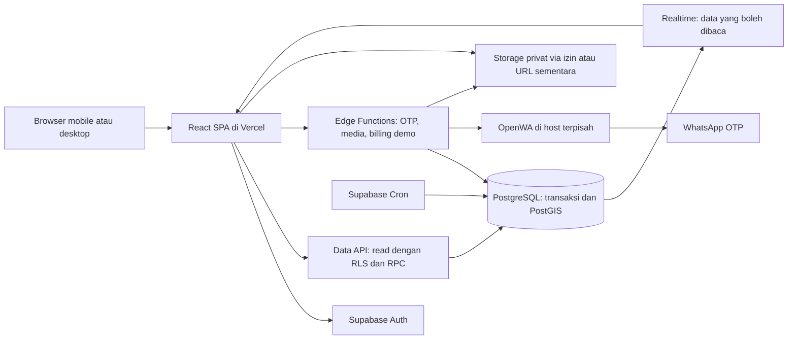
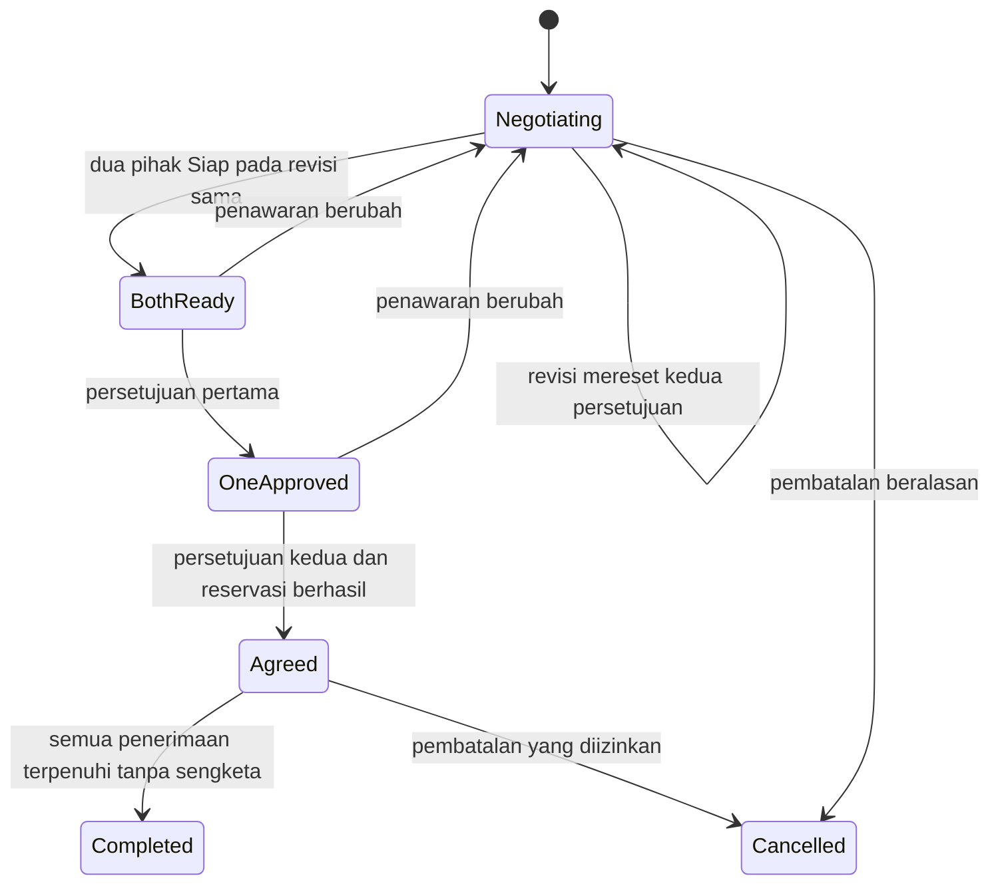

# RFC-001 — Arsitektur dan Eksekusi Teknis Barter

Status: **Draft untuk ditinjau**  
Tanggal: 10 September 2026  
Acuan produk: [PRD v1.3](./PRD.md)  
Target: demo terintegrasi, 9 hari × 3 jam; belum menerima transaksi nyata  
Lingkup perubahan saat penyusunan RFC: dokumentasi saja

## 1. Ringkasan keputusan

RFC ini mengusulkan aplikasi React + TypeScript + Vite di Vercel, dengan Supabase Auth, PostgreSQL, Storage, Realtime, Edge Functions, dan Cron. OpenWA milik rmyndharis berjalan sebagai layanan terpisah untuk mengirim OTP WhatsApp.

Aturan transaksi dijalankan melalui fungsi database yang atomik. Browser tidak boleh langsung mengubah status kesepakatan, reservasi, penerimaan pembayaran, verifikasi nomor, sanksi, atau hak Plus. Realtime membantu memperbarui tampilan; database tetap menjadi sumber kebenaran.

Tiga skenario demonstrasi yang direkomendasikan: barter dua pihak dengan perubahan penawaran dan tambahan uang; PO berkuota dengan DP; aktivasi tiga toko melalui Plus dummy. Ini adalah **usulan prioritas RFC**, bukan keputusan bahwa fitur lain dibatalkan. Pilihan prioritas final masih terbuka pada PRD.

Keputusan teknis di RFC ini adalah rekomendasi yang dapat diimplementasikan. Perubahan yang berdampak pada perilaku produk diberi ID D-xx pada bagian 3, sehingga tidak dianggap sebagai persetujuan produk baru.

## 2. Tujuan dan bukan tujuan

### 2.1 Tujuan

- Mengubah keputusan PRD menjadi batas modul, model data, perintah, dan aturan perubahan status yang jelas.
- Menjamin persetujuan berlaku atas penawaran yang benar-benar dilihat pengguna.
- Mencegah barang/kuota yang sama disepakati melebihi ketersediaan.
- Menjaga lokasi, nomor HP, chat, dan bukti transaksi sesuai hak akses.
- Memisahkan transaksi antar pengguna dari pembayaran langganan platform.
- Memungkinkan demo lintas akun dengan status yang tersimpan, bukan simulasi tampilan semata.

### 2.2 Bukan tujuan

- Escrow, transfer uang transaksi barang, pembuktian transfer otomatis, atau payment gateway nyata.
- Aplikasi native, push notification, staf toko, integrasi kurir, atau WhatsApp untuk notifikasi transaksi.
- Menjamin kesiapan publik dalam 27 jam.
- Microservices untuk setiap domain, event sourcing penuh, atau mesin rekomendasi berbasis ML.
- Menetapkan keputusan hukum atau mengirim laporan polisi otomatis.

## 3. Asumsi dan rekomendasi produk yang belum final

Rekomendasi berikut membuat rancangan dapat ditinjau dan dihitung. Saat diputuskan, sinkronkan dengan PRD sebelum implementasi perilaku terkait. Fondasi yang tidak bergantung pada keputusan tersebut dapat dikerjakan lebih dulu.

| ID | Rekomendasi RFC | Dampak / hal yang perlu ditinjau |
| --- | --- | --- |
| D-01 | Profil wajib nama, nomor terverifikasi, area administratif, dan titik peta; alamat jalan opsional | PRD belum mengunci tingkat detail alamat |
| D-02 | Pengunjung boleh membaca penawaran; publikasi hanya di Jabodetabek; pilihan radius 5/10/20/50 km | Area akun di luar cakupan tidak otomatis ditolak; radius berbasis lokasi perkiraan |
| D-03 | Revisi setelah Disepakati boleh dibuka sebelum penyerahan dan sebelum pembayaran tercatat; persetujuan direset, reservasi lama dipertahankan sampai revisi diterima/dibatalkan | Sesudah pembayaran tercatat, demo memakai permintaan perubahan lewat chat/admin; editor langsung dinonaktifkan, bukan mengubah tagihan lama |
| D-04 | Produk berkuota boleh diedit untuk penawaran baru; pesanan yang sudah ada tetap memakai snapshot lama | Menghindari semua katalog PO terkunci karena satu pesanan |
| D-05 | Satu listing PO mempunyai satu batch aktif; batch berikutnya dibuat setelah batch lama ditutup | Tidak ada scheduler PO berulang otomatis |
| D-06 | Plus berlaku satu bulan kalender, zona Asia/Jakarta, tanggal akhir bulan di-clamp; tanpa auto-debit | Harga tetap Rp20.000; aturan akhir bulan perlu disepakati |
| D-07 | Setelah Plus habis, chat lama terbuka tetapi toko tidak boleh menerima kesepakatan baru; transaksi yang sudah disepakati tetap berjalan | Draft negosiasi tersimpan, menunggu Plus aktif kembali |
| D-08 | Blokir mencegah chat/negosiasi baru; kanal transaksi aktif dan sengketa tetap tersedia dengan pembatasan kontekstual | Ban memberi akses hanya ke penyelesaian kasus sendiri, bukan kegiatan marketplace |
| D-09 | Admin melihat pesan bertag transaksi yang dilaporkan dan pesan yang secara eksplisit dilampirkan sebagai bukti | Chat umum atau transaksi lain tidak otomatis terbuka; permintaan bukti tambahan dicatat |
| D-10 | OTP 6 digit, 5 menit, resend 60 detik, maksimal 5 salah per challenge | Tambahkan batas per akun/nomor/IP; gagal terkirim tidak memverifikasi nomor |
| D-11 | Gambar maksimum 8 per listing/barang, 5 MB per unggahan; JPEG/PNG/WebP | Dibutuhkan pengolahan server untuk menghapus metadata lokasi; tidak ada video/PDF dalam demo |
| D-12 | Minimum PO memakai satuan homogen; DP 1–100% atau tidak ada, dibulatkan ke atas ke rupiah utuh | Paket dan pcs berbeda tidak dijumlahkan sebagai satu minimum |
| D-13 | Setelah penerimaan pertama, status biasa tidak boleh selesai jika ada sengketa terbuka | Keputusan admin memiliki rekam terpisah, tidak memalsukan klik pengguna |
| D-14 | Penurunan batas paket tidak menghapus produk; pengguna di atas batas tidak dapat menerbitkan tambahan | Produk lama tidak diam-diam hilang karena pengaturan admin berubah |
| D-15 | Dalam demo, SKU yang sama tidak diduplikasi ke toko berbeda dan tidak dipindah penerbitnya setelah transaksi ada | Mencegah ketidakjelasan pemilik rating dan stok bersama |
| D-16 | Tenggat DP berupa durasi bayar sejak konfirmasi, dibatasi jadwal produksi/penyerahan | Penjual dan pembeli melihat tanggal/jam hasil perhitungan; kebutuhan tenggat absolut dapat memakai tipe kontrak berbeda |

Pemulihan nomor hilang, batas usia, daftar barang terlarang, banding, retensi bukti, dan kebijakan pengembalian DP tetap memerlukan keputusan produk sebelum pilot nyata. RFC menyediakan ruang data dan mekanisme kasus; tidak mengarang ketentuan pengembalian uang.

## 4. Arsitektur yang dipilih



### 4.1 Komponen dan alasan

| Komponen | Pilihan | Alasan |
| --- | --- | --- |
| Frontend | React, TypeScript, Vite, React Router | Satu SPA untuk feed, akun, transaksi, dan admin; konfigurasi minimal untuk demo |
| Server state | TanStack Query | Cache, refetch setelah mutasi/reconnect, pagination; cache bukan sumber hak akses |
| Form | React Hook Form + Zod | Validasi input dan pesan field; backend tetap memvalidasi ulang |
| Backend domain | PostgreSQL functions via Supabase RPC | Satu transaksi untuk persetujuan, stok, audit, dan notifikasi |
| External I/O | Supabase Edge Functions | OTP/OpenWA, pemrosesan media, dan adapter billing dummy |
| Auth | Supabase Auth | Email/password dan Google OAuth sesuai PRD |
| Chat live | Supabase Postgres Changes | Volume demo terbatas; pesan disimpan sebelum dikirim ke pelanggan Realtime |
| Geo | PostGIS + data wilayah layanan | Filter jarak dan batas layanan tanpa mesin pencarian terpisah |
| Scheduled work | Supabase Cron | Pengingat, kedaluwarsa status turunan, pembukaan ulasan |
| OTP delivery | rmyndharis/OpenWA via HTTPS | Provider yang dipilih pengguna; bukan @open-wa/wa-automate |
| Pengujian | Vitest, pgTAP atau integration tests SQL, Playwright | Unit angka, otorisasi/race database, dan alur dua browser |

Vercel mendukung deployment Vite; rancangan menggunakan build SPA dan rewrite rute aplikasi ke entry HTML. Rute fungsi backend berada di Supabase, sehingga tidak membutuhkan server Express tambahan di Vercel. Trade-off: SEO dan preview sosial dinamis per listing belum menjadi keluaran demo. Jika dibutuhkan saat publik, evaluasi prerender/SSR secara terpisah. [Dokumentasi Vite di Vercel](https://vercel.com/docs/frameworks/frontend/vite).

Alternatif yang dipertimbangkan:

- **Next.js full-stack:** berguna untuk SSR, tetapi memperluas keputusan framework di fase ketika prioritas utama adalah alur transaksi. Tidak dipilih untuk baseline ini.
- **Backend NestJS tersendiri untuk Barter:** memberi kontrol penuh tetapi menambah deployment dan lapisan API. NestJS internal OpenWA tidak berarti backend Barter harus ikut memakai NestJS.
- **Mutasi CRUD langsung dari browser:** mudah diawali, tetapi tidak memberi batas perintah yang jelas untuk konfirmasi dan reservasi banyak baris. Tidak dipakai untuk perubahan bisnis.

### 4.2 Struktur repository yang direncanakan

```text
src/
  app/                  routing, providers, session lifecycle
  features/
    auth/ profiles/ discovery/ listings/ stores/ plus/
    chat/ barter/ orders/ reports/ reviews/ notifications/ admin/
  components/           komponen bersama yang tidak mengandung otorisasi
  lib/                  clients, money, time, query keys, error mapping
  generated/            tipe database hasil generator
supabase/
  migrations/           schema, grants, RLS, functions, indexes, jobs
  functions/
    otp/ media/ billing-demo/ admin-evidence/
    _shared/            auth validation, adapters, error envelope
  tests/                invariant dan policy tests
tests/e2e/              skenario lintas akun
docs/
  PRD.md
  RFC-001-arsitektur-barter.md
```

Belum ada scaffold yang dibuat. Versi package ditentukan saat implementasi, dipin bersama lockfile, lalu dicatat dalam README. RFC tidak mengklaim versi terbaru yang belum diuji bersama.

## 5. Batas otorisasi dan jalur mutasi

### 5.1 Schemas dan privileges

- `public`: tabel domain yang aman dibaca sesuai RLS, read models, serta RPC wrapper dengan kontrak terbatas.
- `private`: nomor/alamat tepat, OTP, billing provider internals, audit admin, serta fungsi privileged. Schema ini tidak diekspos melalui Data API.
- Semua tabel domain yang diekspos mengaktifkan RLS; grant SELECT diberikan eksplisit sesuai kebutuhan. Tidak ada blanket INSERT/UPDATE/DELETE untuk klien pada tabel bisnis.
- Fungsi baca biasa memakai `SECURITY INVOKER`. Perintah yang harus mengubah beberapa tabel memakai wrapper invoker yang memanggil fungsi `private` dengan kewenangan khusus.
- Fungsi privileged diperlukan karena klien tidak mendapat hak DML langsung. Fungsi dimiliki role NOLOGIN dengan hak minimum pada tabel terkait, memakai `search_path = ''`, nama objek lengkap, dan pemeriksaan actor sendiri. Tidak memakai definer sekadar untuk menutupi error RLS.
- Cabut EXECUTE default dari PUBLIC; grant hanya wrapper dan fungsi internal yang benar-benar diperlukan. Fungsi internal yang callable oleh role pengguna tetap wajib memeriksa `auth.uid()` dan seluruh aturan, walaupun schema tidak diekspos REST.
- Fungsi sistem berbeda dari fungsi pengguna: jangan menganggap `auth.uid() IS NULL` sebagai izin admin. Worker/scheduler/billing/OTP memiliki entry point dan grant tersendiri.

Supabase memisahkan grants dari RLS; RLS tidak menggantikan pembatasan EXECUTE pada fungsi. Rancangan grant ini harus dibuat dalam migration yang sama dengan schema/policy. [Securing your API](https://supabase.com/docs/guides/api/securing-your-api), [Database Functions](https://supabase.com/docs/guides/database/functions).

### 5.2 Pemeriksaan setiap perintah

1. Identitas pengguna berasal dari JWT Supabase yang valid, bukan `actor_id` dari body.
2. Baca status akun, kelengkapan profil, verifikasi nomor, dan kemampuan yang diperlukan dari database.
3. Periksa hubungan actor dengan objek: pemilik listing, peserta transaksi, penerima uang, atau admin kasus.
4. Validasi versi, status, waktu server, data masukan, serta idempotency key.
5. Jalankan perubahan atomik; simpan event dan notifikasi terkait dalam commit yang sama.

Edge Functions memverifikasi token sebelum membuat client privileged. Jika harus memanggil fungsi service-only dengan `actor_id`, nilainya berasal dari hasil verifikasi token; tidak diteruskan dari request. Credential server tidak pernah ada di `VITE_*`. [Securing Edge Functions](https://supabase.com/docs/guides/functions/auth).

Status Plus/admin/verifikasi/sanksi tidak boleh diambil dari `user_metadata` yang dapat diedit pengguna. Untuk tindakan sensitif, cek database terbaru agar token lama tidak mempertahankan hak yang sudah dicabut.

## 6. Model data logis

Nama berikut adalah rancangan schema, bukan SQL migration yang sudah dijalankan. Semua ID bisnis memakai UUID; tabel yang dapat berubah memiliki created_at/updated_at dan revision atau row_version sesuai kebutuhan. Waktu memakai `timestamptz` UTC, ditampilkan di Asia/Jakarta. Nominal menggunakan integer rupiah (`bigint`), dikirim sebagai string desimal pada JSON untuk menghindari presisi JavaScript. Jumlah unit positif dan harga tidak negatif.

### 6.1 Identitas, lokasi, katalog

| Entitas | Kolom/relasi utama | Constraint atau invariant |
| --- | --- | --- |
| `profiles` | `id -> auth.users`, display_name, avatar_asset_id, bio | Satu profil per user; hanya data publik yang aman |
| `private.account_state` | user_id, onboarding_status, account_status | Hanya command/admin yang mengubah status |
| `private.phone_claims` | user_id, phone_e164, verified_at, released_at | Unique nomor dan user untuk klaim belum dilepas; ban tidak otomatis melepas nomor |
| `private.user_locations` | user_id, exact_point, address, area_id | Hanya pemilik dan kasus beralasan lewat endpoint terkontrol |
| `service_areas` | area_id, name, polygon, enabled, source_version | Seed wilayah resmi/terverifikasi; Kepulauan Seribu dikecualikan |
| `stores` | id, owner_id, name, slug, description, operating_hours, status | owner immutable dalam demo; jumlah toko dijaga dengan lock akun |
| `private.store_locations` | store_id, exact_point, address, consent_public_at | Alamat lengkap hanya diproyeksikan jika pemilik mengizinkan |
| `listings` | id, owner_id, store_id nullable, category_id, title, description, condition, lifecycle, version | store_id harus milik owner; pemilik tidak berganti setelah ada transaksi |
| `listing_modes` | listing_id, mode: sale/barter/free | sale+barter boleh; free eksklusif |
| `listing_variants` | id, listing_id, label, unit, price_rupiah, active | Varian harus milik listing pada baris pesanan |
| `listing_discovery` | listing_id, area_id, approximate_point, search_vector, price_min, price_max | Hanya proyeksi tanpa koordinat/alamat privat; tidak bisa ditulis klien |
| `preorder_batches` | id, listing_id, order_closes_at, fulfillment_at, minimum_qty, quota_mode, dp_percent, dp_deadline | Satu batch aktif per listing (D-05); snapshot aturan saat menerima pesanan |
| `inventory_pools` | id, listing_id, batch_id?, variant_id?, capacity, held, consumed, is_exclusive | `held >= 0`, `consumed >= 0`, `held + consumed <= capacity` |
| `media_assets` | id, uploader_id, storage_key, state, mime, hash, size | Key immutable setelah terikat snapshot; ownership dan konteks wajib |

`fulfillment_kind` pada listing adalah ready_stock/preorder/catering; ini berbeda dari `listing_modes`. Listing catering/PO dapat diterbitkan lewat profil pribadi maupun toko. Kombinasi awal yang direkomendasikan: PO/catering memakai sale; barter/free pada barang ready_stock.

Untuk varian kuota bersama, semua baris varian merujuk pool batch yang sama; per-varian memakai satu pool untuk tiap varian. Barang tunggal memakai pool eksklusif kapasitas 1. Donasi terbagi memakai pool non-eksklusif. Catering manual tidak menjanjikan stok otomatis; penjual memastikan kapasitas sebelum mengirim ringkasan.

### 6.2 Percakapan dan transaksi

| Entitas | Kolom/relasi utama | Constraint atau invariant |
| --- | --- | --- |
| `conversations` | id, listing_id, user_low, user_high | Unique listing + pasangan user terurut; kedua user berbeda |
| `conversation_members` | conversation_id, user_id, last_read_seq | Hanya dua peserta; cursor dibaca monoton |
| `messages` | id, conversation_id, sender_id?, seq, client_message_id, type, transaction_id?, body | Unique conversation+seq dan sender+client_message_id; append-only |
| `transactions` | id, conversation_id, kind, party_a, party_b, lifecycle, current_revision, accepted_revision?, row_version | Tepat dua peserta berbeda, sesuai conversation; kind immutable |
| `transaction_revisions` | transaction_id, revision, created_by, reason, terms_snapshot, supersedes_revision | Unique transaksi+revision; immutable |
| `transaction_items` | revision_id, offered_by, listing_id?, source_listing_version?, variant_id?, asset_refs, name, details, qty, price_snapshot | Snapshot immutable; hanya barang milik pihak yang menawarkan |
| `transaction_consents` | transaction_id, revision, user_id, ready_at, approved_at | Unique transaksi+revision+user; approve hanya jika kedua ready versi sama |
| `reservations` | transaction_id, pool_id, is_exclusive, qty, revision, state | Unique transaksi+pool aktif; pool eksklusif hanya satu reservasi aktif global |
| `fulfillments` | transaction_id, status, seller_handed_at?, party_a_received_at?, party_b_received_at? | Hanya peran terkait yang mengonfirmasi |
| `payment_obligations` | transaction_id, revision, kind, payer_id, payee_id, amount, due_at, state | DP/balance/topup/shipping; penerima yang dapat mengakui pembayaran |
| `payment_acknowledgements` | obligation_id, recorded_by, amount, recorded_at, evidence_asset_id? | Pencatatan penerimaan manual, bukan data settlement bank; satu pengakuan per kewajiban pada demo |
| `transaction_events` | transaction_id, seq, actor_id?, type, revision, metadata, created_at | Append-only; tidak mengandung OTP/nomor/alamat yang tidak diperlukan |
| `cancellation_requests` | transaction_id, actor_id, reason, status, decided_by? | Tidak otomatis menghapus pembayaran yang sudah dicatat |

Revisi draft juga disimpan sebagai versi immutable untuk audit. Tombol edit menciptakan revisi baru, bukan UPDATE snapshot lama. Status Siap/Setujui dari versi terdahulu tetap menjadi riwayat, tetapi tidak aktif pada `current_revision`.

Relasi listing/variant/pool diperiksa menggunakan foreign key komposit jika memungkinkan dan validasi command untuk aturan lintas tabel. Barang langsung dalam barter memiliki listing_id NULL dan media milik penawar; tidak dibuatkan listing publik tersembunyi.

`reservations.is_exclusive` disalin dari pool dan dijaga oleh foreign key komposit `(pool_id, is_exclusive)` ke pasangan unik pada inventory_pools. Jenis pool tidak boleh diganti setelah dipakai transaksi. Ini memungkinkan partial unique index lokal pada reservations(pool_id) untuk state aktif dan is_exclusive=true tanpa mencoba memakai join/subquery dalam predicate index. Untuk pool eksklusif capacity=1 dan qty reservasi=1 wajib dipenuhi.

### 6.3 Plus, moderasi, dan pekerjaan sistem

| Entitas | Isi utama |
| --- | --- |
| `plan_settings` | harga, batas toko/listing, rasio promosi; versi konfigurasi |
| `subscriptions` | user_id, paid_through, source, last_billing_order_id; satu baris hak aktif per akun |
| `billing_orders` | buyer_id, amount, currency, method, mode=dummy, status, expires_at, activated_at |
| `promotion_rotation` | owner_id, last_served_at, slot_count; rotasi kesempatan per akun |
| `reviews` | transaction_id, author_id, target_user_id/store_id, rating, comment, published_at |
| `review_replies` | review_id, author_id, body; hanya penerima ulasan yang membalas |
| `reports` | reporter_id, target_type, transaction_id/listing_id/review_id, reason, status, assigned_admin_id |
| `report_evidence` | report_id, message_id/asset_id/event_id, submitted_by, scope_reason |
| `private.report_access_log` | report_id, admin_id, accessed_object, reason, timestamp |
| `report_decisions` | report_id, outcome, rationale, required_actions, deadline, decided_by |
| `sanctions` | user_id, capability, severity, starts_at, ends_at?, reason, report_id? |
| `blocks` | blocker_id, blocked_id, created_at |
| `notifications` | recipient_id, type, target_id, dedupe_key, read_at |
| `private.command_receipts` | actor_id, command, idempotency_key, request_hash, result |
| `private.otp_challenges` | user_id, phone, purpose, digest, expires_at, attempts, delivery_state, consumed_at |
| `private.rate_limit_buckets` | subject hash, purpose, window, count |
| `private.admin_roles` | user_id, role, granted_by, revoked_at |
| `private.system_jobs` | dedupe_key, kind, due_at, attempts, status, last_error |

Jangan membuat semua tabel sebagai syarat layar pertama. Migration dibagi menurut alur vertikal pada bagian 18; model lengkap memberi arah konsisten ketika modul bertambah.

### 6.4 Indeks minimum

- GiST pada titik discovery dan polygon area; GIN pada search vector.
- `(lifecycle, created_at DESC, id)` pada listing; `(owner_id, lifecycle)` dan `(store_id, lifecycle)` untuk kuota publikasi.
- `(conversation_id, seq)` pada messages; indeks membership berdasarkan user_id.
- `(party_a, lifecycle, updated_at)` serta `(party_b, lifecycle, updated_at)` pada transaksi.
- Indeks pool dan partial uniqueness untuk reservasi aktif eksklusif.
- `(state, due_at)` pada kewajiban DP; `(status, due_at)` pada jobs.
- Unique `reviews(transaction_id, author_id)` dan `notifications(recipient_id, dedupe_key)`.
- Unique key idempotensi per actor+command+key. Nomor terverifikasi unik dinormalisasi E.164.

## 7. Aturan perubahan status

### 7.1 Status dipisahkan menurut tanggung jawab

`transactions.lifecycle`: negotiating, agreed, completed, cancelled. Flag sengketa tidak mengganti atau menghapus riwayat lifecycle; kasus mempunyai status sendiri dan dapat menahan penyelesaian normal.

`fulfillments.status`: pending, processing, ready_for_pickup, delivering, handed_over. Konfirmasi penerimaan disimpan per pihak, bukan satu boolean bersama.

Status pembayaran diturunkan dari obligations/acknowledgements: not_required, awaiting_dp, payment_review_required, dp_received, unpaid_balance, paid. Tidak ada saldo rekening pengguna di Barter.

### 7.2 Barter

| Perintah | Prasyarat | Efek atomik |
| --- | --- | --- |
| `revise_trade` | Peserta; boleh mengubah penawaran miliknya; batas revisi D-03 | Revisi++, salin paket terbaru, status siap/setuju aktif kosong, event perubahan |
| `mark_trade_ready` | Paket dua pihak dapat ditinjau; paket actor valid; expected_revision sesuai | Catat siap actor pada revisi ini |
| `approve_trade` pertama | Kedua pihak siap pada revisi yang sama | Catat approve actor; menunggu pihak lain |
| `approve_trade` terakhir | Kedua siap dan actor belum approve; semua barang masih tersedia | Lock seluruh pool, reservasi seluruh paket, simpan accepted_revision, lifecycle=agreed |
| `confirm_trade_received` | Actor peserta, lifecycle agreed, tidak ada amendmen/sengketa yang menghalangi | Catat penerimaan hanya untuk actor |
| `acknowledge_topup` | Actor penerima uang, nominal dari kewajiban server | Catat penerimaan uang; tidak boleh dilakukan pembayar |
| `complete_if_eligible` | Kedua penerimaan barang ada; topup jika ada telah diakui; tidak ada hold kasus | lifecycle=completed, ubah held ke consumed, event dan hak ulasan |

`complete_if_eligible` dipanggil internal setelah konfirmasi, bukan tombol bebas yang menerima status dari browser.



BothReady/OneApproved adalah label UI yang diturunkan dari consent, bukan lifecycle terpisah. Jika reservasi gagal pada persetujuan terakhir, seluruh command di-rollback dan kembalikan `ITEM_UNAVAILABLE`; jangan menyimpan kesepakatan tanpa semua barang. Persetujuan pertama sebelumnya tetap menjadi riwayat tetapi tidak dapat dipakai melompati validasi terbaru.

Revisi terhadap listing sumber sebelum kesepakatan: versi sumber dicatat pada item; final approve mendeteksi versi listing berbeda dan meminta refresh/review. Setelah kesepakatan, snapshot dan media yang disepakati tetap dapat dibaca walaupun listing kemudian disembunyikan.

### 7.3 Jual, gratis, dan PO

| Transisi | Actor | Prasyarat/efek |
| --- | --- | --- |
| Draft ringkasan -> dikirim | Penjual/pemberi | Hitung harga server; validasi data penyerahan lengkap |
| Ringkasan -> agreed | Pembeli/penerima | Versi sesuai, reservasi cukup, toko boleh menerima transaksi baru |
| agreed -> processing | Penjual makanan | DP yang diwajibkan sudah diakui; tanpa DP dapat langsung diproses |
| processing -> ready | Penjual | Pesanan siap sesuai metode; boleh belum lunas sebagaimana PRD |
| processing/ready -> delivering | Penjual | Pengantaran dipilih; jika pelunasan sebelum pengiriman diwajibkan, pembayaran sudah diakui |
| -> handed_over | Penjual/pemberi | Konfirmasi penyerahan sendiri; jika pelunasan sebelum pengambilan diwajibkan, pembayaran sudah diakui |
| -> penerimaan pembeli | Pembeli/penerima | Hanya actor terkait; boleh tiba lebih dulu daripada klik penjual |
| -> completed | Sistem | Penyerahan dan penerimaan ada; semua pembayaran wajib diakui; tidak ada kasus terbuka |

Untuk jual preloved tidak ada kewajiban melewati processing. Untuk gratis total barang nol; jika ongkir disepakati, kewajiban shipping menjadi syarat pembayaran terkait. Untuk catering kapasitas manual, command tidak membuat jaminan persediaan otomatis.

### 7.4 Pembatalan dan revisi setelah pembayaran

- Sebelum ada konfirmasi penerimaan barter, pembatalan biasa yang diizinkan melepaskan reservasi. Jika uang tambahan sudah diakui walau belum ada klik penerimaan barang, arahkan ke kasus pengembalian; jangan menghapus kewajiban atau audit pembayaran.
- PO sebelum processing dapat dibatalkan pembeli dengan alasan. Setelah processing, buat cancellation request untuk keputusan penjual.
- Jika ada DP, pembatalan menyimpan jumlah yang telah diakui dan status kebutuhan penanganan pengembalian. Ketentuan snapshot menjadi acuan; aplikasi tidak otomatis menganggap uang hangus atau sudah dikembalikan.
- Setelah ada penerimaan barang, pembatalan biasa ditolak dengan `DISPUTE_REQUIRED`.
- Ketika ada pembayaran tercatat, perintah edit nominal langsung ditolak `PAID_ORDER_AMENDMENT_REQUIRED` pada demo (D-03). Pembahasan perubahan tetap melalui chat/admin. Dukungan penuh membutuhkan proposal amendmen, perhitungan tambahan/refund, dan persetujuan ulang tanpa kehilangan pembayaran lama; ini pekerjaan lanjutan yang terlihat jelas di UI.

### 7.5 Pesanan dan barter menggantung

Setelah konfirmasi penerimaan pertama, catat `first_received_at`. Reminder menggunakan acuan ini: 24 jam untuk pengingat pihak lain; 72 jam untuk kemampuan meminta bantuan admin. Jika telah selesai/dibatalkan atau sudah ada kasus yang sama, job tidak membuat tindakan ganda. Sengketa dapat dibuka kapan saja sesuai PRD.

## 8. Atomisitas, ketersediaan, dan idempotensi

### 8.1 Strategi reservasi

Semua jalur sale/barter/free/PO memakai pool dan fungsi reservasi yang sama. Tidak boleh ada stok terpisah untuk mode jual dan barter pada listing yang sama.

Setiap mutasi mengikuti urutan lock konsisten: account guards yang diperlukan (urut UUID), transaksi (urut UUID jika lebih dari satu), listing terkait (urut UUID), lalu pool (urut UUID). Daftar participant/owner immutable dapat dibaca sebelum lock; setelah lock selalu validasi ulang. Jangan memperbarui transaksi pesaing saat memegang lock pool; notifikasinya diproses sebagai pekerjaan terpisah agar tidak membentuk siklus lock.

Dalam satu database transaction:

1. Validasi actor, status, versi, dan idempotency key.
2. Lock baris terkait dengan `SELECT ... FOR UPDATE`.
3. Gabungkan jumlah kebutuhan per pool, termasuk beberapa varian yang memakai kuota bersama.
4. Pastikan `capacity - held - consumed >= requested` untuk semua pool.
5. Tulis reservasi dan tambah held; finalisasi kesepakatan serta accepted_revision.
6. Simpan event/notifikasi/receipt. Commit seluruhnya atau rollback seluruhnya.

Saat selesai: held dikurangi dan consumed ditambah. Saat pembatalan sebelum penyerahan: held dikurangi, reservasi released; batch yang sudah ditutup tetap tidak dapat dipesan meski kapasitas matematis kembali. Jangan menghapus histori reservasi.

Untuk barang eksklusif, partial unique index memastikan hanya satu active reservation per pool. Pool kuantitas memakai lock dan constraint counter. Minimum pembelian diverifikasi sebelum reservasi, dalam satuan yang homogen.

PostgreSQL row locks bertahan sampai transaksi selesai dan dapat menimbulkan deadlock jika urutannya berbeda; urutan global dan transaksi singkat diperlukan. Jangan memanggil OpenWA atau layanan jaringan sambil memegang lock database. [PostgreSQL explicit locking](https://www.postgresql.org/docs/current/explicit-locking.html).

### 8.2 Revisi dengan reservasi lama

Usulan D-03: ketika transaksi belum dibayar/diserahkan membuka revisi, lifecycle tetap agreed dengan amendment_pending. Consent revisi baru kosong; konfirmasi penyerahan diblokir sampai amendmen diputuskan. Reservasi versi lama tetap menahan barang.

Saat kedua pihak menerima revisi baru, lock gabungan pool lama dan baru, hitung delta, lalu ganti reservasi secara atomik. Jika tambahan stok tidak cukup, versi lama tetap direservasi; jangan melepaskannya lebih dulu. Pembatalan yang diizinkan melepas seluruh hold; penolakan amendmen dapat mengembalikan versi sebelumnya hanya lewat persetujuan eksplisit pihak terkait, bukan otomatis setelah timer.

Untuk demo, UI amendmen setelah agreed dapat ditunda dan diganti arah ke pembatalan beralasan sebelum penyerahan. Penundaan harus tercatat sebagai keterbatasan D-03, bukan mengubah aturan bahwa perubahan penawaran memerlukan persetujuan ulang.

### 8.3 Request berulang dan status basi

- Perintah sensitif membawa `idempotency_key` UUID, `expected_revision` untuk isi penawaran, dan `expected_row_version` jika status yang ditampilkan harus cocok.
- Receipt unik per actor+command+key menyimpan hash request dan hasil commit.
- Key sama dengan payload sama mengembalikan hasil sebelumnya; key sama dengan payload berbeda ditolak.
- Receipt sukses dan perubahan bisnis berada dalam satu commit. Kegagalan validasi tidak menyimpan sukses palsu. Request yang kalah perlombaan key menunggu commit pertama lalu membaca hasil.
- Untuk siap/setuju simultan, versi penawaran menjadi guard utama; perubahan status pihak lain tidak boleh memaksa pengguna mengedit ulang barang. UI dapat refetch dan mengulangi command yang semantik/idempotensinya sama.
- Error `REVISION_CONFLICT` meminta tampilan terbaru dan peninjauan ulang; frontend tidak mengulang persetujuan pada revisi baru secara otomatis.
- Retry timeout/5xx menggunakan key yang sama. Deadlock/serialization failure dapat dicoba ulang terbatas oleh caller; tidak memakai key baru untuk menghindari aksi rangkap.

## 9. Perhitungan uang, kuota, dan tenggat

Semua kalkulasi final berada di database dari item snapshot/harga tervalidasi. Browser hanya menampilkan perkiraan dan hasil server.

```text
subtotal = sum(quantity_i × unit_price_i)
total = subtotal + shipping
dp_due = ceil(total × dp_percent / 100)   // nol jika tanpa DP
balance_due = total - dp_due
```

Jika DP 100%, balance nol dan tidak perlu klik pelunasan kedua. Tidak ada diskon/pajak tambahan yang diada-adakan. Batas nominal/quantity harus divalidasi agar hasil tidak overflow. Untuk uang tambahan barter, hanya satu kewajiban dari satu pihak ke pihak lainnya dan nominal positif.

Usulan tenggat DP (D-16): listing menyimpan durasi bayar (jam); server membentuk deadline saat pesanan dikonfirmasi dan membatasi tidak melewati deadline produksi/penyerahan yang disetujui. Jika penjual membutuhkan tanggal absolut, field kontrak terpisah dengan jenis deadline; jangan menafsirkan satu angka sebagai dua konsep. Ringkasan sebelum konfirmasi menampilkan durasi dan batas akhir; setelah konfirmasi menampilkan deadline final. Jika waktu produksi sudah tidak memungkinkan pembayaran, konfirmasi ditolak dan jadwal perlu diperbarui.

Deadline lewat menghasilkan payment_review_required, tidak membebaskan kuota. Penjual boleh mengakui pembayaran yang masuk sebelum/sesudah tenggat dengan catatan waktu; perubahan keputusan tidak mengklaim waktu transfer bank yang tidak diketahui. Timer memakai jam server. Job tertunda tidak boleh membuat transaksi baru lolos setelah batas batch berakhir; perintah tetap memeriksa waktu saat dijalankan.

## 10. Kontrak API yang diusulkan

Semua nama di tabel adalah **kontrak rancangan**, belum endpoint yang tersedia. Satu command mengembalikan objek terbaru dan version, bukan hanya pesan sukses. Error menggunakan kode stabil untuk UI berbahasa Indonesia.

### 10.1 Bentuk request/response

```json
{
  "transaction_id": "<uuid>",
  "expected_revision": 3,
  "idempotency_key": "<uuid>"
}
```

```json
{
  "ok": false,
  "error": {
    "code": "REVISION_CONFLICT",
    "message": "Penawaran berubah. Tinjau kembali sebelum menyetujui.",
    "current_revision": 4
  },
  "request_id": "<uuid>"
}
```

HTTP mapping: 400 input invalid, 401 belum login, 403 tidak berhak, 404 tidak ditemukan/tidak boleh diketahui, 409 konflik state/stok/versi, 429 batas percobaan, 503 dependency tidak tersedia. Respons tidak mengungkap nomor/email pemilik akun lain.

### 10.2 Edge endpoints

| Endpoint logis | Fungsi | Batas akses |
| --- | --- | --- |
| `POST /functions/v1/otp/request` | Challenge dan kirim OTP | JWT valid; rate limit akun+nomor+IP |
| `POST /functions/v1/otp/verify` | Verifikasi OTP dan klaim nomor atomik | JWT valid; challenge harus milik actor |
| `POST /functions/v1/media/prepare` | Izin upload staging | Pemilik draft atau peserta konteks valid |
| `POST /functions/v1/media/finalize` | Validasi gambar, hapus metadata, buat derivative | File staging milik actor, batas ukuran |
| `POST /functions/v1/billing-demo/create` | Tagihan dummy Plus | User valid, mode server demo |
| `POST /functions/v1/billing-demo/simulate` | Success/fail/expired | Pemilik invoice, allowlist demo, mode server |
| `GET /functions/v1/admin-evidence/:report_id` | Baca paket bukti dengan audit akses | Admin aktif yang diizinkan pada kasus |

Supabase dapat memakai satu function per kelompok dengan router internal; URL path akhir mengikuti router yang dipilih. Tidak perlu satu deployment function per action domain.

### 10.3 RPC domain

| Kelompok | Commands/read functions | Efek/guard penting |
| --- | --- | --- |
| Profil | `complete_profile`, `update_profile`, `set_location` | Nomor/status verified bukan field editable |
| Discovery | `search_listings`, `get_listing`, `search_stores` | Projection publik, radius/filter/visibility dihitung server |
| Listing | `save_listing_draft`, `publish_listing`, `revise_listing`, `archive_listing` | Owner, limit 20/100, snapshot, status reservasi |
| Toko | `create_store`, `update_store`, `set_store_address_visibility` | Plus, limit 3, owner, consent alamat |
| Chat | `open_conversation`, `send_message`, `mark_conversation_read` | Pasangan/listing, block policy, sender dari auth |
| Barter | `create_trade`, `revise_trade`, `mark_trade_ready`, `approve_trade` | Version dan consent kedua pihak |
| Pesanan | `create_order_quote`, `revise_order_quote`, `confirm_order_quote` | Minimum, kuota, harga, jadwal, eligibility toko |
| Pembayaran | `acknowledge_payment` | Obligation valid, actor payee, jumlah dari server |
| Penyerahan | `mark_processing`, `mark_ready`, `mark_delivering`, `confirm_handover`, `confirm_received` | Role, DP/pelunasan, tidak ada blocking dispute |
| Pembatalan | `cancel_transaction`, `request_cancellation`, `respond_cancellation` | Aturan jenis transaksi dan bukti penerimaan |
| Laporan | `create_report`, `attach_report_evidence`, `request_admin_help` | Reporter terkait objek, konteks bukti, dedupe |
| Admin | `assign_report`, `record_report_decision`, `apply_sanction`, `hide_listing` | Role DB aktif, alasan wajib, audit |
| Review | `submit_review`, `reply_review`, `report_review` | Transaksi selesai, target dari server, satu review |
| Notifikasi | `list_notifications`, `mark_notification_read` | Recipient saja |

Jangan sediakan endpoint umum `set_transaction_status`, `set_verified`, atau `set_plus_active` untuk browser. Completion dan perubahan entitlement adalah hasil perintah yang tervalidasi.

## 11. OTP WhatsApp dan siklus akun

### 11.1 Integrasi OpenWA

Provider yang digunakan: [rmyndharis/OpenWA](https://github.com/rmyndharis/OpenWA). README menyediakan REST pengiriman teks dengan API key dan sesi, serta deployment Docker. Backend Barter memanggil `POST /api/sessions/{sessionId}/messages/send-text` dengan tujuan yang dinormalisasi; endpoint/version aktual diverifikasi kembali terhadap image yang dipin saat implementasi. [Contoh API OpenWA](https://github.com/rmyndharis/OpenWA#-api-examples).

Gunakan key operator yang dibatasi ke sesi OTP, bukan admin key. Sesi dihubungkan operator melalui dashboard OpenWA; QR sesi tidak diberikan kepada pengguna Barter. Provider memiliki autentikasi dan scope key tersendiri. [OpenWA authentication](https://docs.open-wa.org/guides/authentication/).

Adapter internal hanya memerlukan `sendOtp(phone, code, challengeId)` dan mengembalikan delivery reference/status; perubahan provider tidak mengubah identitas akun Supabase atau aturan verifikasi.

### 11.2 Penyimpanan dan validasi OTP

1. Edge memvalidasi JWT, normalisasi nomor +62, purpose register/change_phone, dan batas frekuensi.
2. Backend membuat kode acak kriptografis dan challenge terikat user+nomor+purpose.
3. Simpan HMAC kode dengan server pepper, challenge ID dan konteks; bukan plaintext atau hash enam digit tanpa secret. Pepper hanya pada server.
4. Commit challenge lebih dulu, kemudian panggil OpenWA dengan timeout terbatas; tidak menahan lock database selama jaringan berjalan.
5. Catat delivered/failed/unknown sesuai respons. Tidak mengklaim pesan sudah dibaca atau diterima hanya karena API menerima request.
6. Saat verifikasi, lock challenge dan klaim nomor. Cek expired/consumed/attempts, cocokkan digest secara aman, lalu konsumsi challenge dan klaim nomor dalam transaksi yang sama.
7. Percobaan gagal harus meningkatkan attempts dan **tetap commit**; jangan melempar rollback yang membatalkan counter.
8. Unique constraint nomor menyelesaikan perlombaan dua akun yang memverifikasi nomor sama. Pengguna kedua menerima respons aman tanpa identitas akun pertama.

Kirim ulang membuat challenge baru dan membatalkan challenge lama. Timeout pengiriman tidak memicu retry tak terbatas; pengguna meminta ulang setelah cooldown. Kode tidak dimasukkan ke log, analytics, error tracing, notifikasi publik, maupun events.

OpenWA mendokumentasikan kemungkinan pengiriman pertama tidak sampai walau API sukses. Ketika gateway tidak tersedia, UI mempertahankan onboarding pending, menawarkan koreksi nomor/kirim ulang, dan akun tetap boleh melakukan baca sesuai kebijakan pengunjung. Tidak ada bypass verifikasi otomatis ke email karena email tidak membuktikan nomor. [Catatan delivery OpenWA](https://github.com/rmyndharis/OpenWA#known-platform-behaviour-not-bugs).

### 11.3 Demo, recovery, dan session

- Demo end-to-end OTP memerlukan host OpenWA aktif dan nomor khusus. Jika belum tersedia, gunakan akun uji yang diprovisikan secara eksplisit di proyek demo; tampilkan bahwa integrasi OTP belum diuji, bukan menampilkan verifikasi WhatsApp palsu.
- Login Google/email dan verifikasi nomor adalah dua proses berbeda. Tidak perlu menjadikan nomor login Supabase jika pengguna tetap memakai Google/email.
- Pergantian nomor memerlukan sesi yang baru diverifikasi/reauth dan OTP nomor baru. Nomor lama dilepas hanya setelah transaksi penggantian berhasil; ban tidak melepas nomor otomatis.
- Pemulihan nomor yang tidak lagi dikuasai adalah pekerjaan admin terkontrol yang kebijakannya belum final. OTP nomor daur ulang tidak cukup untuk mengambil alih akun lama.
- Password reset memakai alur Supabase email; konfirmasi email dan redirect URL harus dikonfigurasi untuk domain demo.
- Link identity Google/email harus mengikuti identitas terverifikasi dari Supabase, bukan pencocokan nomor atau nama di aplikasi.

## 12. Geo, pencarian, dan privasi

### 12.1 Titik asli dan titik discovery

Koordinat tepat hanya disimpan di schema private. Untuk discovery, backend membuat titik perwakilan grid tetap sekitar 1 km dalam proyeksi metrik yang sesuai; ukuran ini usulan D-02. Public point tidak diacak ulang setiap request karena banyak sampel dapat dirata-ratakan.

Filter radius, urutan terdekat, dan jarak yang dikembalikan memakai titik discovery yang sama. Ini mengurangi kebocoran lokasi tepat melalui pengulangan query dengan pusat/radius berbeda. Trade-off: hasil 5 km bersifat perkiraan, terutama di batas radius; UI menyebut jarak perkiraan. Penentuan apakah listing berada di area layanan tetap menggunakan titik asli server-side.

Store yang memilih alamat publik dapat memakai titik usaha publik; pengubahan consent mengubah proyeksi selanjutnya. Cache detail lokasi harus diinvalidasi, walaupun informasi yang pernah dilihat pengguna tidak dapat ditarik kembali.

PostGIS menyediakan tipe geography dan spatial index; gunakan `ST_DWithin` dalam meter serta GiST, bukan memindai semua lat/lng di frontend. [Supabase PostGIS](https://supabase.com/docs/guides/database/extensions/postgis).

### 12.2 Penemuan dan promosi

- Backend mengecek area layanan, status listing, moderasi, ketersediaan, dan Plus toko secara langsung saat query.
- Keyword awal memakai full-text search konfigurasi simple; optimasi fuzzy dapat ditambahkan setelah ukuran data diketahui. Tidak membutuhkan Elasticsearch.
- Cursor pagination mengikat filter, sort, titik area pencarian, dan ID terakhir; perubahan filter memulai cursor baru.
- Baseline page berisi 20 kartu: 18 organik + maksimum 2 promosi pada posisi 10 dan 20. Jika tidak ada kandidat, isi organik; jangan membuat kartu kosong.
- Kandidat promosi harus cocok filter, tersedia, dan berasal dari akun Plus aktif. Pilih akun dengan giliran terlama, baru pilih produk dari toko-tokonya; tidak memberi bobot lebih karena punya tiga toko.
- Jangan menampilkan produk yang sama dua kali pada halaman yang sama; hapus duplikat kandidat organik/promosi. Giliran dihitung sebagai slot dialokasikan, bukan klaim bahwa pengguna benar-benar melihat iklan.
- Untuk demo, rotasi hanya mutasi metadata promosi melalui entry point terkontrol dengan rate limit. Permintaan feed retry memakai page token agar tidak menghabiskan giliran dua kali. Penghitungan impression publik/anti-fraud skala besar bukan scope demo.
- Usulan D-04: PO dengan sebagian kuota tersisa tetap tersedia/dapat dipromosikan; yang dikecualikan adalah kuota habis, bukan seluruh listing hanya karena satu unit direservasi.

Data wilayah dan peta harus memakai sumber berizin dengan atribusi yang sesuai. Penyedia tiles/geocoder belum dipilih; demo dapat memakai pilihan area dan browser geolocation terlebih dahulu. Jangan menganggap browser geolocation membuktikan domisili atau keberadaan fisik.

## 13. Storage, chat, dan notifikasi

### 13.1 Media dan snapshot

- Gunakan bucket privat untuk staging, gambar katalog, lampiran chat, dan bukti.
- Upload mendapat object key acak yang terikat actor/konteks. Backend memeriksa MIME sebenarnya, ukuran, jumlah, dan kepemilikan.
- Server men-decode dan men-encode ulang gambar untuk menghapus EXIF/GPS; kompresi klien saja tidak memenuhi aturan privasi. Library pemrosesan perlu divalidasi pada limit Edge Functions saat implementasi.
- Media yang belum selesai diproses tidak boleh dipublikasikan atau menjadi bukti snapshot final.
- Published derivatives dapat dibaca melalui signed URL singkat setelah pengecekan visibilitas; lampiran chat hanya untuk peserta, bukti hanya dalam kasus yang diizinkan.
- Gambar pada snapshot tidak di-overwrite. Mengganti foto membuat objek baru; objek yang dirujuk transaksi/laporan tidak dihapus oleh penghapusan listing.
- Hak baru langsung berhenti setelah revocation, tetapi URL yang sudah diterbitkan dapat bertahan sampai TTL. Baseline TTL 60 detik untuk bukti/chat dan 5 menit untuk katalog adalah usulan teknis yang harus terlihat dalam model ancaman.
- Jangan memakai path yang mengandung nomor HP atau alamat. Cleanup staging tidak terpakai dijadwalkan; retensi data sengketa memerlukan kebijakan final.

Supabase Storage menggunakan kebijakan akses atas objects; signed URL dan policy dipakai menurut tujuan media, bukan bucket publik untuk semua file. [Storage access control](https://supabase.com/docs/guides/storage/security/access-control).

### 13.2 Chat dan konteks bukti

- `send_message` memeriksa membership dan block/sanction policy, mengunci counter conversation untuk seq monoton, serta menyimpan pesan dalam commit sebelum delivery. Perintah domain yang menulis pesan sistem mengikuti urutan lock yang sama; alternatifnya membuat pekerjaan pesan sistem setelah commit agar tidak membalik urutan lock transaksi.
- `client_message_id` dari klien mencegah duplikasi saat retry.
- Pesan umum memiliki transaction_id NULL; saat membahas kesepakatan tertentu, composer menampilkan konteks transaksi dan menyimpan tag tersebut. Kartu sistem selalu bertag transaksi.
- Read cursor per anggota menyatakan pesan yang telah dibaca; pengguna tidak dapat menandai pihak lain sudah membaca. Unread dihitung dari seq dan sender.
- Realtime hanya untuk tabel/row yang lolos SELECT policy. Reconnect melakukan fetch pesan setelah cursor terakhir dan refetch transaksi; event Realtime bukan satu-satunya sumber perubahan.
- Admin tidak menjadi anggota semua conversation. Bukti kasus dibaca melalui endpoint audited sesuai D-09, bukan langganan Realtime seluruh chat.

Postgres Changes memerlukan konfigurasi publication dan akses baca sesuai RLS. Pilihan ini cocok untuk volume demo; scaling nanti dapat dievaluasi tanpa mengubah penyimpanan pesan. [Postgres Changes](https://supabase.com/docs/guides/realtime/postgres-changes).

### 13.3 Pekerjaan terjadwal dan notifikasi

Perubahan domain dan notifikasi langsung ditulis dalam transaksi database yang sama. Peristiwa yang membutuhkan tindak lanjut tertunda membuat `system_jobs` dengan dedupe key; tidak membutuhkan broker terpisah untuk demo.

Cron menjalankan batch pendek setiap menit: claim job yang jatuh tempo, periksa ulang state, buat notifikasi idempotent, lalu tandai selesai. Worker paralel memakai skip-locked/lease; kegagalan diberi retry terbatas dengan backoff dan error tercatat. Tidak mengubah timestamp bisnis untuk mempercepat demo.

Jobs: pengingat DP, payment review required, pengingat penerimaan 24 jam, akses bantuan 72 jam, pengingat Plus, publikasi ulasan barter setelah 14 hari, dan cleanup staging. Tombol bantuan dan visibilitas Plus juga mengecek waktu pada request, sehingga correctness tidak bergantung pada Cron tepat waktu.

Supabase Cron dapat menjalankan SQL/database functions dan mencatat hasil job; gunakan job kecil, bukan loop panjang dalam request pengguna. [Supabase Cron](https://supabase.com/docs/guides/cron).

## 14. Plus dummy dan toko kedaluwarsa

### 14.1 Entitlement

`is_plus_active(user) = paid_through > server_now AND tidak ada sanksi yang meniadakan kemampuan terkait`. Hak toko dibaca server-side setiap publish/accept agreement/query publik, bukan dari boolean yang disimpan klien.

Membuat toko keempat atau listing di atas batas harus gagal walaupun dua request berjalan bersamaan: lock guard akun/toko sebelum count dan insert. Draft/arsip/selesai tidak dihitung; reserved dihitung. Menurunkan batas memakai D-14.

Toko yang Plus-nya habis menjadi tidak visible secara efektif tanpa harus menunggu update massal status semua listing. Status terbit asli dipertahankan; ketika langganan aktif lagi, listing dapat kembali terlihat jika tidak diarsipkan, dimoderasi, habis, atau melewati batas PO.

### 14.2 Simulasi pembayaran

- Server membuat invoice Rp20.000 IDR, method=qris/virtual_account, mode=dummy, pending. UI menampilkan QR/VA ilustrasi yang tidak dapat dipakai untuk transfer dan tulisan simulasi.
- Success hanya melalui function demo dengan token pengguna, invoice miliknya, allowlist user demo, serta konfigurasi server `BILLING_MODE=dummy` dan project environment non-live.
- Invoice pending -> paid/failed/expired hanya sekali. Callback ulang paid mengembalikan hasil yang sama, tanpa memperpanjang dua kali.
- Aktivasi invoice dan penambahan paid_through berada dalam satu transaksi, lock baris subscription.
- Dua invoice berbeda yang valid boleh menambah dua periode secara serial. Nilai invoice berasal dari server, bukan body nominal.
- Periode baru memakai `max(server_now, paid_through)` ditambah satu bulan kalender lokal dengan clamp akhir bulan (D-06).
- Jangan membuat endpoint dummy tersedia pada lingkungan live hanya karena tombolnya disembunyikan. Saat provider nyata ditambahkan, konfirmasi berasal dari webhook provider tervalidasi, bukan browser.

Semua konfirmasi pembayaran barang/DP/topup tetap manual dan terpisah dari invoice Plus. Tidak ada penggunaan invoice Plus untuk menampung transaksi antar pengguna.

## 15. Moderasi, reputasi, dan akses data

### 15.1 Matriks akses minimum

| Data/aksi | Pengunjung | Pemilik/peserta | Pengguna lain | Admin |
| --- | --- | --- | --- | --- |
| Listing/toko visible | Baca projection | Baca, edit lewat command sesuai state | Baca projection | Moderasi beralasan |
| Nomor dan alamat privat | Tidak | Data sendiri; alamat transaksi yang dibagikan | Tidak | Hanya lewat kebutuhan kasus yang dicatat |
| Chat umum | Tidak | Dua peserta | Tidak | Hanya pesan yang dilampirkan untuk laporan |
| Snapshot transaksi | Tidak | Dua peserta, termasuk setelah toko hilang dari publik | Tidak | Kasus terkait saja |
| Pengakuan pembayaran | Tidak | Hanya payee dapat mencatat | Tidak | Dapat mencatat keputusan kasus, bukan menyamar sebagai payee |
| OTP digest/provider secret | Tidak | Tidak | Tidak | Tidak lewat panel admin; service internal saja |
| Ulasan belum terbit | Tidak | Penulis saja | Tidak, termasuk penerima ulasan | Akses laporan spesifik jika diperlukan |
| Sanksi dan hak Plus | Tidak bisa ubah | Tidak bisa ubah langsung | Tidak | Command sesuai role; billing service untuk Plus |

RLS diterapkan untuk read paths termasuk request langsung, bukan hanya query yang dibuat UI. Proyeksi yang merupakan view harus memakai security_invoker atau aksesnya dicabut dan disajikan lewat fungsi dengan field allowlist. Tidak ada auto SELECT semua kolom.

### 15.2 Siklus kasus

Usulan state kasus: open -> reviewing -> awaiting_information -> decided -> awaiting_followup -> closed; transisi tidak harus melewati awaiting_information jika bukti cukup. Keputusan mempunyai outcome seperti no_action, return_required, cancel_transaction, admin_complete, restrict_account. Setiap keputusan menyebut rationale dan pihak/tindakan yang diperlukan.

Admin boleh memutuskan hasil platform, tetapi tidak menulis `received_at` atau `paid_at` seolah pengguna telah mengonfirmasi. Penyelesaian oleh admin menggunakan event `admin_resolution` dan actor admin yang terlihat pada riwayat.

Sengketa setelah transaksi Selesai membuat case hold, bukan mengurangi consumed/menambah stok otomatis. Listing baru tersedia lagi hanya setelah ada keputusan dan konfirmasi kondisi/pengembalian yang memadai. Pengembalian uang/DP manual dicatat sebagai tindak lanjut; tidak diklaim otomatis selesai.

Laporan untuk transaksi yang sama digabung ke kasus aktif atau ditautkan, agar dua admin tidak mengeluarkan keputusan bertentangan. Lock report/transaction pada keputusan final. Admin yang merupakan peserta transaksi tidak boleh menangani kasusnya sendiri.

Ban/restriction memblokir capability sesuai tabel kebijakan, bukan menghapus profil. Akses penyelesaian kasus sendiri tetap tersedia sesuai D-08. Penerapan sanksi mencabut kegiatan baru segera lewat pengecekan database, termasuk ketika token auth lama masih valid.

### 15.3 Rating

- Backend menentukan target profil atau store dari snapshot penerbit transaksi, bukan pilihan author.
- Rating 1–5, satu ulasan per author/transaksi. Hanya pihak yang berhak menurut jenis transaksi.
- Untuk barter, publish kedua ulasan dalam satu transaksi saat lengkap; jika belum lengkap, publish setelah completed_at + 14 hari.
- RLS/read API menyembunyikan ulasan tertunda dari pihak lawan, termasuk agregat/rating yang dapat membocorkan nilainya.
- Rating toko/profil dihitung hanya dari review published yang tidak disembunyikan lewat moderasi. Jangan menggabungkan tiga toko ke satu rating toko.
- Pemilik dapat membalas sekali pada demo; edit/review pascasengketa menunggu kebijakan produk. Riwayat moderasi tetap tersimpan.

## 16. UI dan perilaku kegagalan

Rute yang diusulkan: `/`, `/search`, `/listings/:id`, `/listings/new`, `/stores`, `/stores/:slug`, `/my/listings`, `/my/stores`, `/chat/:id`, `/transactions/:id`, `/plus`, `/notifications`, `/profile`, `/onboarding`, `/admin/reports`, `/admin/reports/:id`.

- Navigasi mobile utama: Beranda, Cari, Pasang, Pesan, Akun. Menu toko berada di akun; admin memakai rute terpisah.
- Halaman transaksi menampilkan kedua pihak, isi versi aktif, status, kewajiban uang, serta tombol yang diizinkan. Label tidak hanya mengandalkan warna.
- Tombol Siap dan Setujui tidak optimistic: tunggu hasil server. Saat versi berubah, tampilkan perubahan dan batalkan kesiapan visual.
- Konfirmasi DP/pelunasan/topup menyebut siapa membayar, berapa nominal, dan bahwa penjual sudah memeriksa uang masuk.
- Empty state memberi arah tindakan; error field tetap mempertahankan input pengguna.
- Offline: tampilkan status tidak tersambung; jangan mengantre persetujuan/pembayaran secara diam-diam. Draft lokal boleh disimpan dengan penanda belum terkirim.
- Aksesibilitas: keyboard/focus, label form, error terkait field, layar 360 px tanpa overflow, dan tombol yang mudah disentuh.
- Cache query dipisah per user dan dibersihkan saat logout; data akun sebelumnya tidak boleh terlihat setelah pergantian akun.

## 17. Verifikasi dan kriteria penerimaan

Ini rencana pengujian implementasi, bukan hasil tes aplikasi yang sudah dijalankan.

| ID | Skenario | Hasil wajib | Lapisan |
| --- | --- | --- | --- |
| T-01 | OTP salah, expired, reuse, dan verifikasi nomor sama oleh dua akun | Tidak ada klaim salah; attempts tetap bertambah; paling banyak satu pemilik nomor | Integration |
| T-02 | B mengubah foto/uang setelah A siap/setuju | Kedua consent revisi baru kosong; approve revisi lama gagal | SQL + E2E |
| T-03 | Dua transaksi final approve listing yang sama bersamaan | Hanya satu agreed; lainnya konflik tanpa reservasi parsial | SQL concurrency |
| T-04 | Paket barter berisi 3 barang, satu tidak tersedia | Tidak ada barang lain ikut tertahan dari command gagal | SQL |
| T-05 | Dua pembeli merebut kuota terakhir | Tidak oversell; shared variant digabung sebelum pengecekan | SQL concurrency |
| T-06 | PO Rp100.000 DP 50%; DP 100%; nominal ganjil | Rp50.000/Rp50.000; nol saldo jika 100%; pembulatan sesuai aturan | Unit + SQL |
| T-07 | DP lewat tenggat dan gateway/cron terlambat | Review required, kuota tidak dilepas, penjual dapat memeriksa | Integration |
| T-08 | Pembeli mencoba mengakui DP sendiri atau langsung set status completed | Ditolak di API/RPC langsung, bukan hanya tombol hilang | Authorization |
| T-09 | Plus dummy callback diulang dan dua invoice berbeda | Invoice sama tidak menambah dua kali; invoice berbeda diserialisasi | SQL |
| T-10 | Plus lewat masa aktif saat Cron mati | Toko tidak publik; peserta masih bisa menyelesaikan transaksi lama | Integration |
| T-11 | Dua request membuat toko ke-3/ke-4 atau listing terakhir | Batas maksimum tidak terlampaui | SQL concurrency |
| T-12 | Query user lain, Realtime, foto, atau direct REST | Nomor, lokasi tepat, chat, snapshot privat tidak bocor | RLS + storage |
| T-13 | Satu chat berisi dua transaksi, hanya satu dilaporkan | Admin hanya menerima konteks yang diizinkan; akses tercatat | Authorization |
| T-14 | Salah satu menerima lalu pihak lain membatalkan | DISPUTE_REQUIRED; reservasi tidak dilepas | SQL + E2E |
| T-15 | Topup belum diakui tetapi kedua barang diterima | Belum completed | SQL |
| T-16 | Reminder worker berjalan ulang/reconnect chat | Tidak ada notifikasi/pesan rangkap; pesan tertinggal di-fetch | Integration |
| T-17 | Review barter baru satu, lalu kedua, atau 14 hari lewat | Review tersembunyi sampai syarat publish; rating tidak bocor lebih awal | SQL |
| T-18 | Jalur dummy dipanggil pada konfigurasi live | Ditolak server, walau request dibuat manual | Integration |
| T-19 | Pembatalan transaksi yang sudah selesai lalu laporan pengembalian | Stock consumed tidak tiba-tiba tersedia | SQL |
| T-20 | Logout A lalu login B pada browser sama | Tidak ada cache chat/transaksi A tersisa | E2E |

Definition of Done per alur: UI tersambung database; happy path dan penolakan peran/state diuji; error dapat dipahami; snapshot/audit tersedia; tidak ada data privat di log; keterbatasan demo ditulis. Alur tidak dinyatakan selesai jika hanya tombol/tampilan yang berubah lokal.

## 18. Urutan implementasi dan batas waktu

Rencana berikut mengalokasikan 27 jam, **bukan estimasi terverifikasi bahwa seluruh scope pasti muat**. Checkpoint menentukan apakah perlu mengurangi keluaran demo; pengurangan tidak boleh dilakukan diam-diam. Waktu menunggu credential/host tidak disulap menjadi fitur selesai.

| Hari | Alokasi 3 jam | Keluaran / checkpoint |
| --- | --- | --- |
| 1 | 0,5 setup; 1 auth/schema; 1 profil+OTP adapter; 0,5 verifikasi | Repo/app berjalan; keputusan readiness OpenWA; akun uji nyata |
| 2 | 1 listing/storage; 1 feed+lokasi; 1 validasi akses | Posting dan pencarian area; gambar tanpa metadata privat |
| 3 | 1 chat; 1 model transaksi/snapshot; 1 integration | Dua akun melihat percakapan dan revisi yang sama |
| 4 | 1,5 consent+reservasi barter; 0,5 topup/penerimaan; 1 race tests | **Checkpoint A:** barter end-to-end dan penolakan persetujuan lama |
| 5 | 1 quote+varian; 1 kuota+DP; 1 pelunasan/tes | **Checkpoint B:** PO tanpa oversell, DP manual |
| 6 | 1 toko/limit; 1 Plus dummy; 1 expiry+promosi/tes | **Checkpoint C:** maksimal tiga toko, aktivasi idempotent |
| 7 | 1,5 reuse jual/gratis; 0,5 notifikasi; 1 perbaikan integrasi | Alur berbagi komponen terhubung; keterlambatan diukur |
| 8 | 1 laporan/admin minimum; 0,5 review; 1,5 akses/bukti/tes | Kasus terkontrol; tidak ada akses seluruh chat admin |
| 9 | 1,5 E2E+mobile; 1 perbaikan; 0,5 naskah/demo | Build demo dan daftar fitur berjalan/belum berjalan |

Jika checkpoint A/B/C belum lolos, prioritaskan perbaikan auth, data, persetujuan, dan stok. Kandidat penundaan yang harus dilaporkan: peringkat relevansi lanjutan, rotasi promosi yang canggih, UI laporan lengkap, amendmen setelah pembayaran, dan konfigurasi admin yang luas. Jangan mengganti OTP, penyelesaian transaksi, atau RLS dengan bypass agar demo terlihat selesai.

### 18.1 Migration dan seed

Urutan migration logis:

1. Schemas/grants/roles, profiles, phone/account state, area dan katalog.
2. Media, discovery, stores, plan/subscription primitives.
3. Conversation/messages, transaksi/revisi/item/consent.
4. Pool/reservation, obligations/acknowledgements, commands/barter/order.
5. Reports/sanctions/reviews/notifications/jobs dan policies.
6. Index tuning, seed konfigurasi/area, job schedule.

Semua perubahan dipertahankan sebagai migration versioned dan diverifikasi pada database uji kosong. Gunakan workflow CLI Supabase yang tersedia pada versi terpasang; jangan menjalankan migrasi pada proyek pengguna yang belum ditargetkan secara eksplisit.

Seed demo: dua akun warga, satu pemilik tiga toko, satu admin, listing preloved, paket barter, PO varian, donasi terbagi, akun Plus aktif/expired, serta kasus contoh. Gunakan alamat/nomor/data sintetis; credential seed tidak masuk repository publik. Demo OTP menggunakan nomor yang benar-benar diizinkan pemiliknya, bukan pengiriman ke nomor contoh acak.

### 18.2 Lingkungan dan operasi

- Local: Vite dan Supabase lokal bila Docker tersedia; alternatif proyek Supabase demo terpisah. Pilihan alternatif harus dicatat.
- Preview/demo: Vercel preview + Supabase demo + OpenWA HTTPS pada host terpisah. OpenWA memerlukan sesi/data persisten; lokasi host dan biaya belum dipilih.
- Live: belum diluncurkan. Tidak berbagi tabel/credential dengan demo dan tidak mengaktifkan dummy billing.
- Konfigurasi publik: `VITE_SUPABASE_URL`, `VITE_SUPABASE_PUBLISHABLE_KEY`.
- Server secrets: Supabase secret/service credential jika diperlukan, `OPENWA_BASE_URL`, `OPENWA_API_KEY`, `OPENWA_SESSION_ID`, `OTP_PEPPER`, mode lingkungan/billing dan allowlist demo.
- Auth redirect URL dikunci ke domain yang dikenal; email provider/SMTP dikonfigurasi sebelum menguji signup/reset di luar lokal.
- Error log menggunakan request_id, command, transaction_id, code, durasi; redaksi kode OTP, message body, alamat tepat, nomor, dan tokens.
- Pantau kesehatan sesi OpenWA, kegagalan kirim OTP, conflict/oversell rejection, job gagal, serta error RLS. Jangan menyimpan seluruh payload chat demi observabilitas.
- Rollback aplikasi memakai build terakhir yang sesuai schema; migration cenderung additive. Jangan menghapus tabel atau snapshot untuk rollback demo. Perubahan destruktif perlu rencana migrasi terpisah.

## 19. Kesesuaian dengan PRD

| Bagian PRD | Bagian RFC | Catatan |
| --- | --- | --- |
| 3–5: wilayah, akun, privasi | 3, 5, 11, 12 | Detail alamat/OTP/recovery tetap ditandai keputusan |
| 6: Plus dan toko | 6, 14 | Rp20.000, 3 toko, limit 20/100, dummy dan expiry |
| 7–8: listing/feed/promosi | 6, 12, 13 | Kategori/jenis dipisah; kuota parsial D-04 |
| 9: barter | 7–8 | Dua siap+dua setuju, multi-item, topup, snapshot |
| 10: jual/gratis | 7–9 | Satu model reservasi/penyerahan |
| 11–12: PO/DP/pengantaran | 7–9 | Konfirmasi manual, kuota, tenggat, ongkir |
| 13: chat/notifikasi | 13 | Realtime persisted, WhatsApp OTP saja |
| 14–15: sengketa/reputasi | 15 | Case-scoped access, review bertahap, admin audit |
| 16–18: stack/demo/metrics | 4, 17–18 | Rancangan, bukan deployment/tes yang telah selesai |

## 20. Catatan verifikasi dokumentasi dan langkah berikutnya

Dokumentasi Supabase, Vercel, PostgreSQL, dan proyek OpenWA ditinjau saat penyusunan; tautan ditempatkan dekat keputusan terkait. Changelog Supabase yang relevan:

- Extension version pinning telah berubah; migration tidak mengasumsikan `CREATE EXTENSION ... VERSION` memilih versi arbitrer. Gunakan default extension yang tersedia pada proyek dan catat versi terpasang. [Changelog extension version](https://supabase.com/changelog/extension-version-pinning-ignored).
- Schema `realtime` tidak boleh dimodifikasi untuk tabel aplikasi. Gunakan tabel aplikasi/publication yang didukung; jangan menambah objek aplikasi di schema internal tersebut. [Changelog Realtime schema](https://supabase.com/changelog/realtime-schema-locked-down-against-modification).

RFC ini sudah memberi kontrak rancangan untuk mulai menurunkan pekerjaan, tetapi belum membuktikan kompatibilitas library, performa, delivery WhatsApp, atau kebenaran SQL yang belum ditulis. Langkah berikutnya: tinjau D-01–D-16 dan prioritas demo, lalu buat implementation backlog dengan acceptance tests di bagian 17. PRD tetap sumber keputusan produk; RFC direvisi jika keputusan produk berubah.
